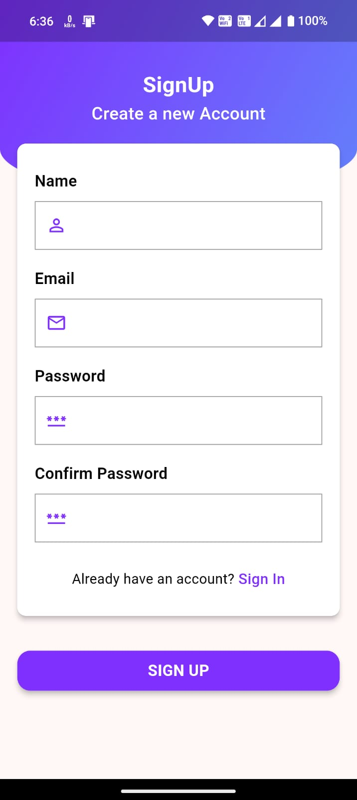
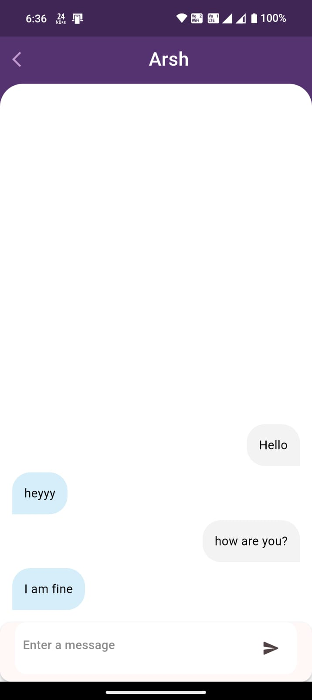

# Convo - The Chatting App

A real-time chat application built using Flutter and Firebase, featuring user authentication, real-time database integration, and more.

## Features

- **User Authentication:** Secure sign-up and login functionality.
- **Realtime Database Integration:** Messages sync instantly across devices.
- **User Interface Design:** Clean and intuitive design for seamless user experience.
- **Sending and Receiving Messages:** Text messages with timestamp functionality.
- **User Presence and Status:** Know when users are online or offline.
- **Error Handling and Edge Cases:** Robust handling of errors and unexpected scenarios.

 # App Demo - [Video Link](https://www.youtube.com/watch?v=RV2FHkkrbLU&ab_channel=ModdyNerd)

 ## Screenshots 📸

 




## Technologies Used

- **Flutter**
- **FireBase** - Authentication, Database
- **Dart** 


## Contributing

Contributions are welcome! If you have any suggestions, bug reports, or improvements, feel free to open an issue or submit a pull request.

1. **Fork the repository.**
2. **Create a new branch:**
    ```bash
    git checkout -b feature/your-feature-name
    ```
3. **Make your changes and commit them:**
    ```bash
    git commit -m 'Add some feature'
    ```
4. **Push to the branch:**
    ```bash
    git push origin feature/your-feature-name
    ```
5. **Open a pull request.**

## License

This is licensed under the [MIT License](https://choosealicense.com/licenses/mit/), allowing for open collaboration and innovation in the spirit of shared knowledge.

## Contact

If you have any questions or feedback, feel free to reach out:

- **Email:** nilawaranimesh@gmail.com
## 🔗 Links

[](https://www.linkedin.com/in/animesh-nilawar/)
